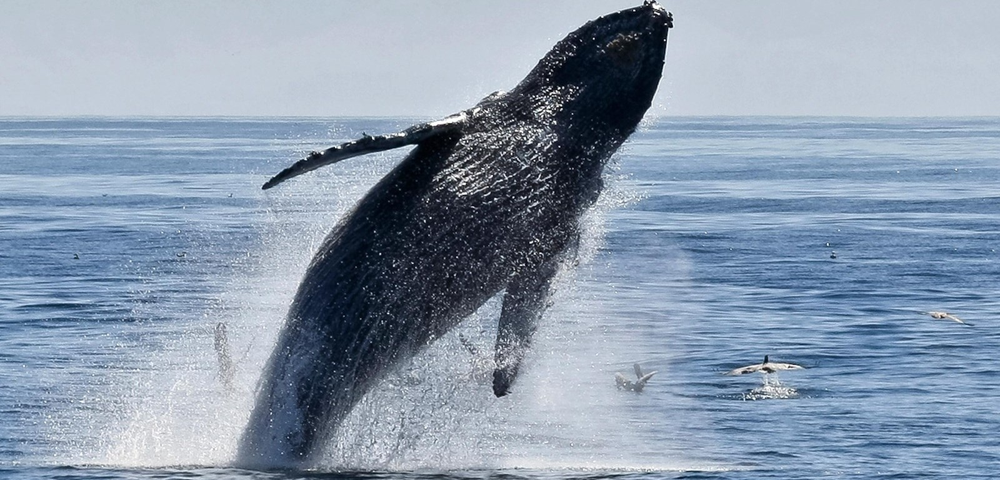

# Whales image classification using ANN

  

## RoadMap:
1. [RoadMap](#roadmap)
2. [Project introduction & context](#project-introduction-&-context)
3. [Dataset](#dataset)
4. [Steps of the project](#steps-of-the-project)
    - [Data processing & manipulation](#data-processing-&-manipulation)
    - [Definition & training of models](#definition-&-training-of-models)
5. [Model evaluation](#model-training)
6. [Conclusion](#conclusion)

## Project introduction & context:
Whales and dolphins, collectively known as cetaceans, are vital to the health of our marine ecosystems. Yet, accurately identifying their species from images poses a significant hurdle in marine biology. This project aims to address this by leveraging an artificial neural network (ANN) model for automatic species classification from images.
The main objective of this project is to build an artificial neural network (ANN) model capable of automatically classifying four types of cetaceans from images of their dorsal fins:
- Dusky Dolphin
- Humpback Whale
- Melon-headed Whale
- Blue Whale

*__Note on Current State:__* While this project successfully implements an ANN model for classification, it currently faces challenges such as overfitting. This repository serves as a foundational exploration, and future work aims to address these limitations (e.g., through the use of Convolutional Neural Networks) in a subsequent project.

## Dataset 
For this project, the [GATE-engine/happy-whale-dolphin-classification](https://huggingface.co/datasets/GATE-engine/happy-whale-dolphin-classification) dataset from Hugging Face is utilized. This dataset is well-organized and diverse. Due to its large size, a subset of the full dataset is used.

Each sample in the dataset contains the following attributes:
- `image`: An encoded image (bytes) representing the cetacean's dorsal fin.
- `species`: A numerical identifier for the species.
- `species_name`: The clear name of the species (e.g., blue_whale).
- `individual`: Identifier for the individual animal.
- `individual_name`: A unique identifier for the specific dorsal fin image.

The original dataset contains images from 10 cetacean classes. However, due to the significant class imbalance, I opted to focus on the four classes with the largest number of images: `dusky_dolphin`, `humpback_whale`, `melon_headed_whale`, and `blue_whale`.

## Steps of the project:
In this part we will go through the steps followed in the building process of the final ANN model.
### Data processing & manipulation
The raw image data was subjected to the following preprocessing pipeline to prepare it for model ingestion:
* **_Resizing_**: All images were uniformly resized to 128×128 pixels to standardize the input dimensions for the model.
* **_Normalization_**: Pixel values were normalized to a range between 0 and 1. This normalization step is critical for optimizing gradient descent convergence and enhancing model stability during training.
* **_Label Encoding_**: Species labels were converted into one-hot encoded vectors, which is suitable for multi-class classification tasks.
* **_Data Splitting_**: The processed dataset was systematically partitioned into distinct training, validation, and testing subsets to facilitate robust model development and unbiased performance evaluation.

### Definition & training of models
In the [notbook](notebook_code_whales-classification-ann-model-hajaraafane-adia_g1.ipynb) you can find the 2 first models from which I collected isights to develop the final one with better performance. For the final one here are more insights:

### 1. Model Architecture
The model's architecture is as follows:
* Input Layer: A Flatten layer converts the 128×128×3 input images into a 49152-value vector, preparing them for the dense layers.
* Hidden Layers: The network consists of three successive Dense (fully connected) hidden layers:
  - 1st Hidden Layer: 1024 neurons
  - 2nd Hidden Layer: 512 neurons
  - 3rd Hidden Layer: 256 neurons

Each of these hidden layers incorporates several key components to enhance performance and reduce overfitting:
* L2 Regularization: Applied to reduce overfitting by penalizing large weights, helping to simplify the model.
* Batch Normalization: Stabilizes the neural network training by normalizing the inputs of each layer for every mini-batch, accelerating convergence.
* ReLU Activation Function: Used to speed up training and mitigate the vanishing gradient problem often seen with other activation functions.
* Dropout Layers: With decreasing rates (0.5, 0.4, 0.3) after each hidden layer, this technique temporarily deactivates a percentage of neurons and their connections during training. This forces the network to learn more robust features and significantly reduces overfitting.
* Output Layer: A Dense layer with a softmax activation function. This is suitable for multi-class classification, outputting probabilities for each of the four cetacean species.

### 2. Compilation and Training
Once the architecture was defined, the model was compiled and trained using the following configurations:

**__Model Compilation__**:

* Optimizer: Adam with a learning rate of 0.00005, chosen for its stable convergence properties.
* Loss Function: Categorical Crossentropy, appropriate for multi-class classification problems with one-hot encoded labels.
* Evaluation Metrics: Accuracy, Precision, and Recall were monitored to provide a comprehensive assessment of prediction quality, especially relevant given the potential for class imbalances.

**__Training Preparation & Strategy__**:

To optimize and manage the training process, two main callbacks were employed:
* EarlyStopping: Configured to monitor validation performance, this callback halts training if the validation performance stops improving, effectively preventing further overfitting.
* ModelCheckpoint: This callback automatically saves the model weights that achieved the best performance on the validation dataset, ensuring the most effective model version is preserved.

**__Training Execution__**:

The model was trained for 150 epochs, with a batch size of 64. This means model weights were updated after processing every 64 images, striking a balance between training speed and stability. At the end of each epoch, the model's performance was evaluated on the validation set to track its progress and detect early signs of overfitting.

Finally, the best-performing model version, identified by ModelCheckpoint, was saved to a .keras file for later use.

## Model evaluation
After training, the best-performing model (saved via ModelCheckpoint) was loaded and evaluated on the test set to assess its generalization capabilities. The model achieved the following results on the test set:

    * Accuracy: 80.19%
    * Precision (Overall): 82.65%
    * Recall (Overall): 76.42%
    * Loss:83.02%

These results indicate a generally strong overall performance, with a high precision of 82.65% suggesting that the majority of the model's positive predictions were correct. A recall of 76.42% implies that some instances of certain classes might have been missed or under-represented in the predictions. The relatively high loss value, despite good accuracy, suggests some uncertainty in the model's predictions, particularly for borderline or visually ambiguous cases. Overall, the model demonstrates good reliability.

The confusion matrix further confirms the solid overall performance. Notably, species such as `dusky_dolphin` and `humpback_whale` were correctly identified in the majority of cases. However, some confusions persist:
- `blue_whale` and `humpback_whale`: Misclassifications were observed between these two species.
- `melon_headed_whale` and `humpback_whale`: Similar confusion patterns were noted here.

These confusions can be attributed to several factors, including visual similarities between these cetacean species and the class imbalance observed in the training data for these particular categories.

## Conclusion
This project successfully developed an Artificial Neural Network (ANN) model for the automatic classification of four cetacean species based on dorsal fin images. Despite encountering challenges such as overfitting and specific inter-species confusions, the model achieved a commendable test accuracy of 80.19% and high precision, demonstrating the viability of ANNs for this marine biology application. This work serves as a foundational step, and future iterations will focus on leveraging more advanced architectures like Convolutional Neural Networks (CNNs) to further enhance robustness and accuracy, addressing the identified limitations and contributing to improved cetacean monitoring techniques.

## Author

**Hajar A**
* [GitHub Profile](https://github.com/Ha-neu-l)
* [LinkedIn Profile](https://www.linkedin.com/in/hajar-a-109a22229/) 

*July 2025*